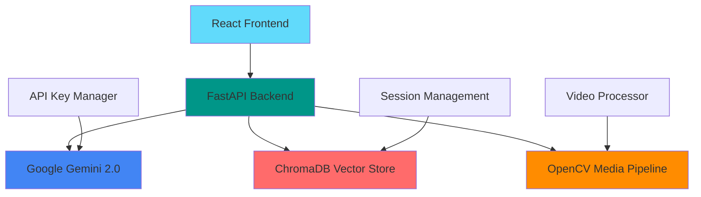

# StreamSightAI 🎬

**Enterprise-Grade Multimodal AI Chat Platform for Video & Image Analysis**

[](https://stream-sight-ai.vercel.app)
[](https://python.org)
[](https://reactjs.org)
[](https://fastapi.tiangolo.com)
[](https://ai.google.dev)

> **StreamSightAI** is a cutting-edge multimodal AI platform that enables intelligent conversations about videos and images. Powered by Google's Gemini 2.0 Flash, it provides real-time analysis, context-aware responses, and enterprise-grade reliability for multimedia content understanding.

---

## ✨ Key Features

### 🧠 **Advanced AI Capabilities**
- **Multimodal Understanding**: Analyze videos, images, and text simultaneously
- **Context-Aware Conversations**: ChromaDB-powered memory for intelligent follow-ups
- **Real-time Processing**: Optimized frame extraction and analysis pipeline
- **Semantic Search**: Vector-based context retrieval for relevant responses

### ⚡ **Enterprise Architecture**
- **Intelligent API Key Rotation**: Automatic failover and load balancing
- **High-Performance Backend**: FastAPI with async/await patterns
- **Scalable Infrastructure**: Thread pools and connection pooling
- **Robust Error Handling**: Exponential backoff and graceful degradation

### 🔧 **Production-Ready Features**
- **Real-time Health Monitoring**: System stats and performance metrics
- **Comprehensive Logging**: File and console logging with multiple levels
- **Secure Configuration**: Environment-based secrets management
- **CORS Support**: Cross-origin requests for web deployment

---

## 🏗️ System Architecture



### **Data Flow Architecture**
```
┌─────────────────┐    HTTP/Multipart     ┌─────────────────┐
│   React Client  │◄─────────────────────►│  FastAPI Server │
│                 │                       │                 │
└─────────────────┘                       └─────────┬───────┘
                                                    │
                                          ┌─────────▼───────┐
                                          │ Gemini 2.0 Flash│
                                          │   AI Service    │
                                          └─────────────────┘
                                                    │
                                          ┌─────────▼───────┐
                                          │   ChromaDB      │
                                          │ Vector Database │
                                          └─────────────────┘
                                                    │
                                          ┌─────────▼───────┐
                                          │ OpenCV Pipeline │
                                          │Video Processing │
                                          └─────────────────┘
```

---

## 🛠️ Technology Stack

### **Backend Technologies**
| Component | Technology | Purpose |
|-----------|------------|---------|
| **Web Framework** | FastAPI | High-performance async API |
| **AI Model** | Google Gemini 2.0 Flash | Multimodal understanding |
| **Vector Database** | ChromaDB | Context-aware memory |
| **Media Processing** | OpenCV + NumPy | Video/image analysis |
| **Configuration** | Pydantic Settings | Type-safe configuration |
| **Async Runtime** | Uvicorn + asyncio | Concurrent request handling |

### **Frontend Technologies**
| Component | Technology | Purpose |
|-----------|------------|---------|
| **Framework** | React 19.1 | Modern UI components |
| **Styling** | Tailwind CSS 4.1 | Utility-first styling |
| **HTTP Client** | Axios | API communication |
| **Routing** | React Router 7.7 | SPA navigation |
| **Icons** | Lucide React | Beautiful icons |

---

## 🚀 Quick Start

### **Prerequisites**
- Python 3.8+ installed
- Node.js 16+ installed
- Google Gemini API key(s)
- Git installed

### **1. Clone Repository**
```bash
git clone https://github.com/kunalverma2512/StreamSightAI.git
cd StreamSightAI
```

### **2. Backend Setup**
```bash
# Navigate to backend directory
cd python-backend

# Create virtual environment
python -m venv venv
source venv/bin/activate  # Windows: venv\Scripts\activate

# Install dependencies
pip install -r requirements.txt

# Configure environment variables
cp .env.example .env  # Create .env file
# Add your Gemini API keys to .env file
```

**Environment Configuration (`.env`)**:
```env
# Primary API key
GEMINI_API_KEY=your_primary_api_key_here

# Additional keys for rotation (optional)
GEMINI_API_KEY_2=your_second_api_key_here
GEMINI_API_KEY_3=your_third_api_key_here

# Server configuration
HOST=0.0.0.0
PORT=9000

# Performance tuning
MAX_WORKERS=4
CACHE_SIZE_LIMIT=100
```

### **3. Frontend Setup**
```bash
# Navigate to frontend directory
cd ../frontend

# Install dependencies
npm install

# Configure environment
cp .env.example .env
# Update API endpoint in .env if needed
```

### **4. Run the Application**

**Terminal 1 - Backend:**
```bash
cd python-backend
python main.py
```

**Terminal 2 - Frontend:**
```bash
cd frontend
npm run dev
```

**Access the application at:** `http://localhost:5173`

---

## 📡 API Documentation

### **Core Endpoints**

#### **Health Check**
```http
GET /
```
**Response:**
```json
{
  "status": "ok",
  "message": "Service is running"
}
```

#### **System Statistics**
```http
GET /api/v1/stats
```
**Response:**
```json
{
  "api_key_stats": {
    "key_1_...abc": {
      "usage_count": 42,
      "last_error": null,
      "is_current": true
    }
  },
  "cache_size": 15
}
```

#### **Multimodal Chat**
```http
POST /api/v1/infer
Content-Type: multipart/form-data
```

**Parameters:**
- `prompt` (string, required): User question or instruction
- `video_file` (file, optional): Video or image file
- `session_id` (string, required): Conversation identifier

**Example cURL:**
```bash
curl -X POST "http://localhost:9000/api/v1/infer" \
  -H "accept: text/plain" \
  -F "video_file=@sample_video.mp4" \
  -F "prompt=What's happening in this video?" \
  -F "session_id=demo_session_123"
```

---

## 🎯 Usage Examples

### **Video Analysis Workflow**

1. **Upload Video + Initial Prompt**
```javascript
const formData = new FormData();
formData.append('video_file', videoFile);
formData.append('prompt', 'Describe the main activities in this video');
formData.append('session_id', 'analysis_session_001');

const response = await axios.post('/api/v1/infer', formData);
```

2. **Follow-up Questions (Context Aware)**
```javascript
const followUp = await axios.post('/api/v1/infer', {
  prompt: 'How many people are visible?',
  session_id: 'analysis_session_001'  // Same session
});
```

3. **Detailed Analysis**
```javascript
const detailedAnalysis = await axios.post('/api/v1/infer', {
  prompt: 'What emotions can you detect?',
  session_id: 'analysis_session_001'
});
```

### **Supported Media Formats**

**Video Formats:**
- MP4, AVI, MOV, WMV, FLV, MKV, WebM

**Image Formats:**
- JPG, JPEG, PNG, GIF, BMP, TIFF

**File Size Limits:**
- Maximum: 100MB per file
- Recommended: Under 50MB for optimal performance

---

## 🔧 Advanced Configuration

### **Backend Configuration**

**Performance Tuning (`app/core/config.py`):**
```python
class Settings(BaseSettings):
    # API Configuration
    host: str = "0.0.0.0"
    port: int = 9000
    
    # Performance Settings
    max_workers: int = 4
    cache_size_limit: int = 100
    max_frames: int = 5
    target_fps: int = 1
    
    # Database Settings
    chroma_db_path: str = "./chroma_db"
```

**API Key Management:**
- Supports multiple API keys for load balancing
- Automatic rotation on rate limits
- Usage statistics tracking
- Error recovery mechanisms

### **Frontend Configuration**

**Environment Variables (`.env`):**
```env
VITE_API_BASE_URL=http://localhost:9000
VITE_MAX_FILE_SIZE=104857600  # 100MB
VITE_SUPPORTED_FORMATS=mp4,avi,mov,jpg,png
```

**Build Configuration (`vite.config.js`):**
```javascript
export default defineConfig({
  plugins: [react()],
  server: {
    port: 5173,
    host: true
  },
  build: {
    outDir: 'dist',
    sourcemap: true
  }
});
```

---

### **Frontend Deployment**

**Vercel Deployment (`vercel.json`):**
```json
{
  "version": 2,
  "builds": [
    {
      "src": "package.json",
      "use": "@vercel/static-build",
      "config": { "distDir": "dist" }
    }
  ],
  "routes": [
    { "handle": "filesystem" },
    { "src": "/.*", "dest": "/index.html" }
  ]
}
```


## 📊 Monitoring & Analytics


### **Logging Configuration**
```python
import logging

logging.basicConfig(
    level=logging.INFO,
    format='%(asctime)s - %(name)s - %(levelname)s - %(message)s',
    handlers=[
        logging.FileHandler('chat_api.log'),
        logging.StreamHandler()
    ]
)
```

### **Performance Metrics**
- Average response time
- Concurrent user handling
- Memory usage patterns
- ChromaDB query performance

---

## 🐛 Troubleshooting

### **Common Issues**

**1. API Key Errors**
```bash
Error: "No valid Gemini API keys found"
Solution: Verify GEMINI_API_KEY in .env file
```

**2. ChromaDB Permission Issues**
```bash
Error: "Permission denied: ./chroma_db"
Solution: Ensure write permissions in project directory
```

**3. Video Processing Errors**
```bash
Error: "Could not extract frames from video"
Solution: Check file format and install opencv-python
```

**4. Frontend Connection Issues**
```bash
Error: "Network Error"
Solution: Verify backend is running on correct port
```

### **Debug Mode**
Enable detailed logging:
```python
# Backend
logging.getLogger().setLevel(logging.DEBUG)

# Frontend
VITE_DEBUG=true npm run dev
```

---

## 🤝 Contributing

We welcome contributions! Please follow these steps:

### **Development Setup**
1. Fork the repository
2. Create a feature branch: `git checkout -b feature/amazing-feature`
3. Make your changes
4. Add tests if applicable
5. Commit changes: `git commit -m 'Add amazing feature'`
6. Push to branch: `git push origin feature/amazing-feature`
7. Open a Pull Request

### **Code Style**
- **Backend**: Follow PEP 8 guidelines
- **Frontend**: Use Prettier and ESLint configurations
- **Commits**: Use conventional commit messages

### **Testing**
```bash
# Backend tests
python -m pytest

# Frontend tests
npm run test
```

---

## 🙏 Acknowledgments

- **Google AI** for Gemini 2.0 Flash API
- **FastAPI** team for the excellent framework
- **ChromaDB** for vector database capabilities
- **OpenCV** community for computer vision tools
- **React** team for the frontend framework
- **Vercel** for hosting platform
- **Open Source Community** for inspiration and support

---

## 📞 Support & Contact

- **Live Demo**: [stream-sight-ai.vercel.app](https://stream-sight-ai.vercel.app)
- **GitHub Issues**: [Report bugs or request features](https://github.com/kunalverma2512/StreamSightAI/issues)
- **Documentation**: Check the `/docs` folder for detailed guides
- **Community**: Join our discussions in GitHub Discussions

---

**Made with ❤️ for the AI Community**
**Contributors-Kunal Verma, Aditya Pratap Singh, Hemant Pathak, Laaksh Parikh, Hardik Sirohia.**
*StreamSightAI - Bringing Intelligence to Visual Content*
